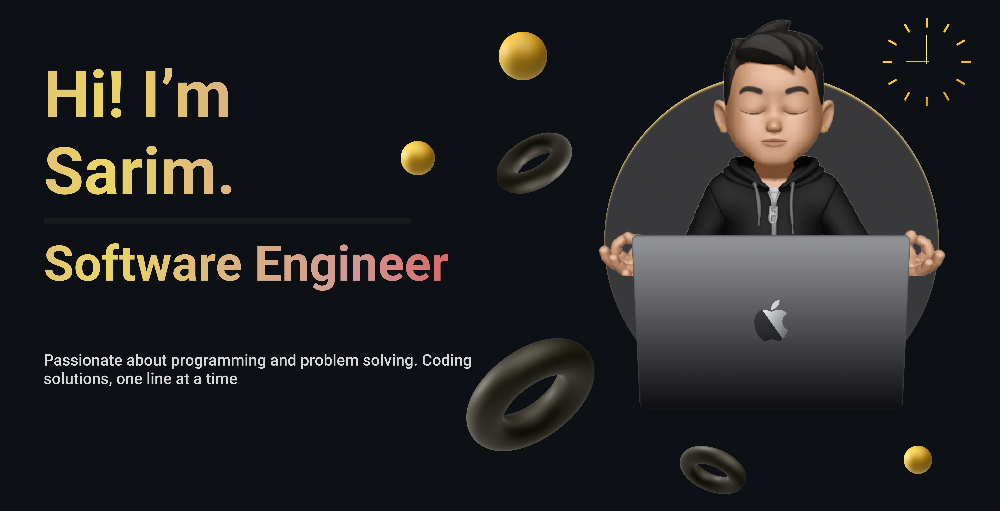

  

  

### ⚡️ Here is a bit about me
- JavaScript and TypeScript developer with +2 years of experience
  - Developed multiple types of projects including CMS and e-commerce
  - Specializing in frameworks and libraries including:
    - React
    - Next.js
    - Node.js
    - Express
    - NestJS
    - React Native
- Current position: Software Engineer at Maqsood Labs
- Experienced in deployment and deployed multiple projects using:
  - AWS ECS
  - Digital Ocean
  - CI/CD with Bitbucket Pipelines and GitHub Actions
- Containerized projects using Docker
- Write test cases using:
  - Jest
  - React Testing Library
- Published npm package:
  - [react-fetch-intercept](https://www.npmjs.com/package/react-fetch-interceptor)

 

